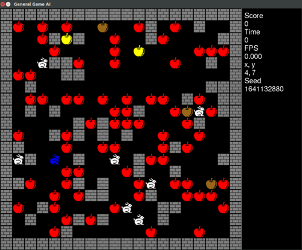

# RL Game 2D Grid

Top-down 2D discrete grid game to develop reinforcement learning for robot
/ animal like [General Game AI](https://en.wikipedia.org/wiki/General_game_playing)
agents. Human and machine playable. Features several mechanics in a single
coherent game world. Created with C++, SDL and Boost R-Tree. Demo video:
<https://youtu.be/TQ5k2u25eI8>

1. [**Getting started**](getting-started.md)
1. [Rationale](rationale.md)
1. [Controls](controls.md)
1. [Examples](examples.md)
1. [CLI options](cli-options.md)
1. [TODO](TODO.md)
1. [LICENSE](LICENSE.md)

Art from: <https://github.com/game-icons/icons>
